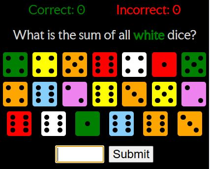
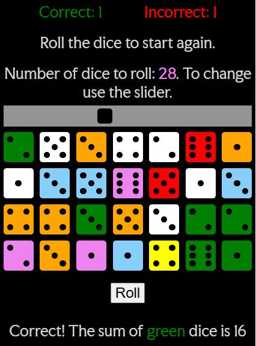
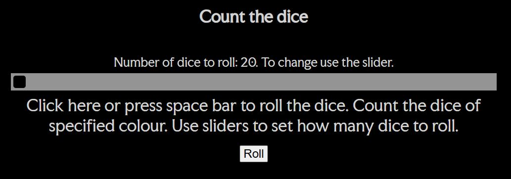
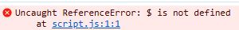
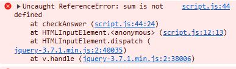
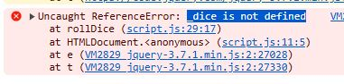
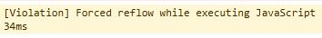
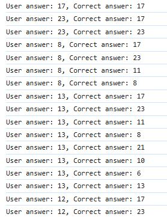
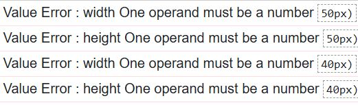

# Dice count

This is a calculation game, displaying randomly generated dice and asking users to count dice of a certain colour.
Website is deployed here: <https://andiskrams.github.io/dice-count/>

## Rationale

I created a dice rolling game for users who want to practice the skill of quick dice counting under changing circumstances. To make the game more engaging and challenging there are 7 different colours of dice, but users are asked to count only dice of one randomly chosen colour. To require extra attention from players, the name of the specified colour in the question is coloured, but not necessarily in the same colour as the word states.

The game has an easily overseeable layout with a dice display area in the middle, between the question and the answer input area. On a page load there are short instructions for new users, explaining the features of the game.

For player convenience the game has 2 event listeners for main interactions, allowing users to freely switch between clicking in the game area or using the keyboard.

For the site's owner, wishing to further develop the game with additional features, code has comments explaining functionality to make future development easier. Dice display is made with HTML and CSS code, allowing easy customisation of the colours. There are no purely decorative elements or images, allowing to add new features without disrupting style consistency.

## Site features

Games website consists of the dice display area sandwiched between the question display and answer submit areas. Clicking on the dice area activates dice roll function. On top of the dice area is a slider for changing the amount of dice rolled.  At the top of the page there is a score display and at the bottom area for feedback. Buttons and the input field become invisible when not used. On page load instead of a dice display there is a short explanation of game features. The header from top disappears after the game is started.

### Potential features left to implement

Currently there is no timer implemented. To make the game more engaging the timer will compel users to complete the task faster. Having a timer allows to develop a version of the game where after a certain amount of consecutive correct answers the game becomes faster and/or the amount of rolled dice increases.

## Design choices

To make the playing process easier, the website for this game is designed as a single page without scrolling except for the smallest screens.  As the main part of the website is dice display other features are located around it. The page has a simple vertical layout which follows the game's logic - first there is a question displayed, then dice displayed and below the player is prompted to input an answer.  To keep the game's appearance clear, unused features are hidden during playing. That’s especially important for mobile screens to avoid unnecessary scrolling. I chose to use black background as it looked better with multicolored dice and can reduce eye strain while playing.

As there are little text font sizes are relatively large. I used Faculty Glyphic font for all text on the website.

## Development

After creating a rough html layout with the placeholders for the game features I started to implement JavaScript code to generate random values and display them as dice. First I used the images of dice, but realising limitations of a preset colours for the further development I changed code to use CSS and HTML for displaying dice elements. The resulting code on each dice roll generates a few random variables, displays dice of various colours and a question for the user to complete calculation.

The next step was to create code for checking users' answers and displaying feedback. Performing manual tests I noticed that the player's score becomes incorrect after a couple of rounds. I checked the syntax with linter and used console.log messages to see the values of variables. Tests showed previously generated dice values to be compared against users input from the last answer. To figure out how to stop values generated previously appearing in the function checking users' answers was a major hurdle in the development of this project.

To solve this issue I tried to restructure the code by moving the nested function checkAnswer() outside and resetting variables after use. In the process of fixing the code I was able to spot and solve some issues slowing the execution, but the main issue with repeated occurrence of values persisted. Eventually, in a training session, I got an indication about the problems with event listeners and in which part of the code to turn them off.

Adding the function that sets off both event listeners for input solved the issue with recurring values, but this prevented repeated input in case of empty or invalid input. To deal with it I restructured the code so that the function to validate input is called before the answer is checked and event listeners are set off.

After testing JavaScript code I did styling and cleaning of the code.

## Technologies used

* HTML, CSS, Javascript, Jquery.
* Visual Studio Code as an IDE. I used some Copilot suggestions and Code review.

## Testing

While automatic testing is significantly faster and more accurate, I didn’t use any test code for this relatively simple application which doesn't have many scenarios of events. Manual testing is more flexible and allows to take in account users' experience.

At the start of the project I relied on console error messages to spot bugs. First one was: Uncaught ReferenceError: $ is not defined.  That was caused by jquery link in index.html being located after script.js.

During the development process I continued to look for reference errors in the console after implementing changes. There were few instances of not defined variables.   To solve them I checked spellings of variable names and looked at the scope of functions.

Implementation of the checkAnswer function started to give wrong feedback on manual functionality tests and the console started to show forced reflow violation,  indicating that code of the game starts to slow down after repeated rolls. Logging variables in different locations of the code showed repetition of variables generated in previous dice rolls. The reason for this occurrence was unclosed event listeners.

Finally adding closures of two event listeners after each of them resolved this issue.

### Validators

#### HTML

Code passed validation without any errors at <https://validator.w3.org>

#### CSS

<https://jigsaw.w3.org/css-validator/> showd errors caused from use of calc() with % for width and height:

#### JavaScript

In the process of development I regularly passed code through jslint.com linter to identify syntax issues and errors. Near the end of the project I installed ESLint in VS Code and checked that the final version of JS contains no errors.

### Unsolved bugs

There are no identified bugs in the implemented website.

## Deployment

* The site was deployed to GitHub pages. The steps to deploy are as follows:
  * In the GitHub repository, navigate to the Settings tab
  * From the source section drop-down menu, select the Master Branch
  * Once the master branch has been selected, the page will be automatically refreshed with a detailed ribbon display to indicate the successful deployment.

The live link can be found here - <https://andiskrams.github.io/dice-count/>

## Credits

* To create dice display HTML and CSS I used this article -  <https://dev.to/ekeijl/creating-dice-using-css-grid-j4>
* Range slider is built using this tutorial - <https://www.w3schools.com/howto/howto_js_rangeslider.asp>

* Font "Faculty Glyphic" by Koto Studio from <https://fonts.google.com/>
